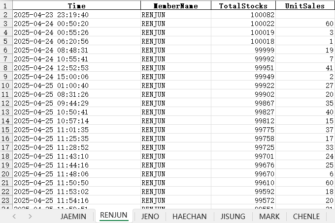

# KMStation Stock Tracking

A lightweight Python tool to automatically monitor and track the real-time stock changes of KMStation product listings.

---

## Environment Requirements

- **Python version**: 3.8 or above (recommended 3.10+)
- **Operating System**: Windows / macOS / Linux (all supported)
- **Package dependency**: `requests`

>  If you don't have Python installed, follow the quick guide below!

---

## How to Install Python

1. **Download Python**  
   Visit the official Python website:  
    [https://www.python.org/downloads/](https://www.python.org/downloads/)

2. **Install Python**
   - Click **Download Python 3.x.x**
   - Run the installer
   - **Important:**  
     -  Make sure to **check the box** for `Add Python to PATH` before clicking Install!
   
3. **Verify installation**  
   After installing, open your terminal (Command Prompt / PowerShell / Terminal) and type:

   ```bash
   python --version
    ```
---

## Features

- Track multiple product IDs (`prodId`) simultaneously
- Automatically record data every 5 minutes (customizable)
- Save per-member stock data into individual CSV files
- Automatically calculate "Unit Sales" (sales during last interval)
- Log all update activities into `monitor_log.txt`
- Simple configuration via `config.py`

---

## Project Structure


```text
your_project_folder/
│   ├──kms/
│      ├── config.py           # Configuration file (prodIds and interval) 
│      ├── monitor.py          # Main program logic
│      ├── monitor_log.txt     # Auto-generated log file
│      ├── [prodId folders]/   # Auto-generated folders for each product ID
│         ├── [prodID].xlsx
│         ├── [MemberName1].csv
│         ├── [MemberName2].csv
│         └── ...
│   ├──kms-weidian/
│      ├── config.py           # Configuration file (prodIds and interval) 
│      ├── monitor_weidian.py          # Main program logic
│      ├── monitor_log.txt     # Auto-generated log file
│      ├── [prodId folders]/   # Auto-generated folders for each product ID
│         ├── [prodID].xlsx
│         ├── [MemberName1].csv
│         ├── [MemberName2].csv
│         └── ...
```

## Example Output

Each member will have a dedicated CSV file under their corresponding product ID folder, and a master Excel file where a dedicated worksheet will log the real-time sales records once the stock has changed.  

  

This is an example for CSV generated for each member.  

  

This is an example of an Excel file generated for all members. It only records the time and quantity when a member's stock changes, making the data easier to read. Each member's information is recorded independently in a separate worksheet.  


---

## Setup Instructions

1. **Clone the repository**
   
   ```bash
   git clone https://github.com/your-username/KMStation-stock-tracking.git
   cd KMStation-stock-tracking
    ```
2. **Install dependencies**
    ```bash
    pip install requests
    ```
3. **Edit the configuration**
    ```text
    Open config.py and modify:
    prod_ids = [3712, 3713]  # Replace with the prodIds you want to track
    interval_seconds = 300   # Adjust the interval (in seconds) as needed

    ```
4. **Run the tracker in the terminal**
    ```bash
    python monitor.py
    ```
---

## Output Files

1. **CSV Files**
```text
Each CSV file includes:

Time of record

Total monthly sales

Total sold units

Member name

Current total stocks

Unit sales compared to the last record

Example CSV Record:
Time,                    TotalMonthSales,    TotalSoldNum,   MemberName, TotalStocks,    UnitSales
2025-04-21 19:40:00,     225,                225,            MARK,       99992,          20
```
2. **Log File**
```text
monitor_log.txt records each successful update and any errors for future review.
```
---

## Licence
This project is licensed under the MIT License.
Feel free to fork, improve, and customize it for your own needs!
